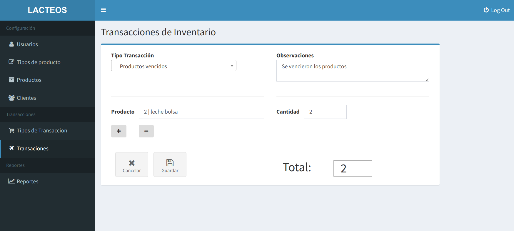
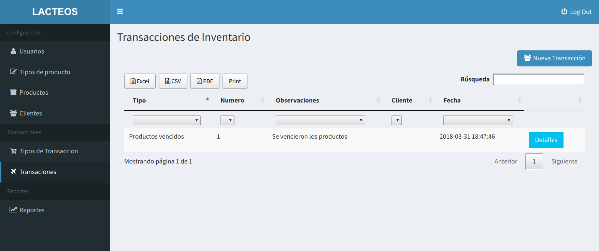
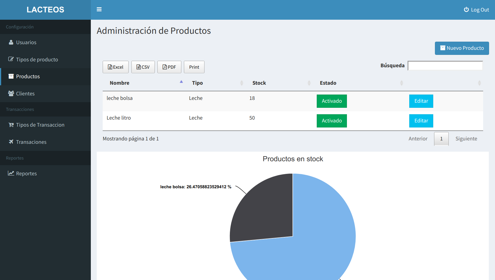
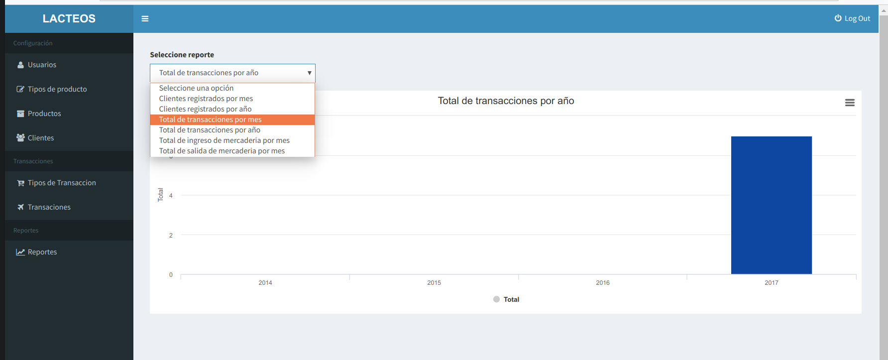
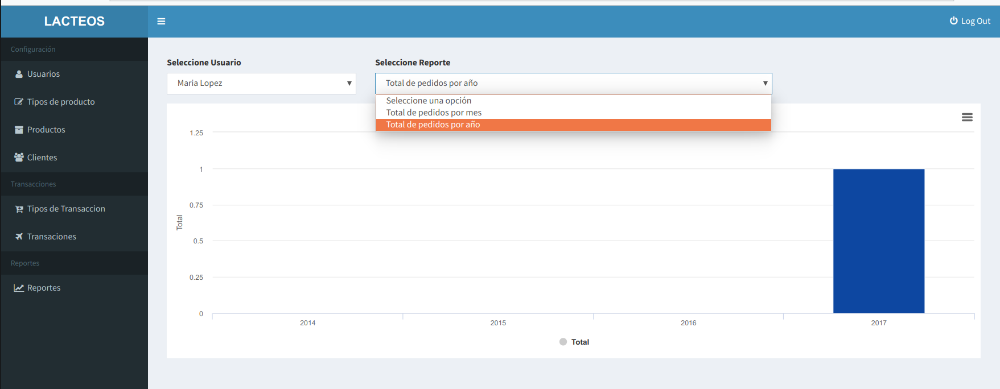

# empresa_lacteos_control_de_ventas
El sistema está dirigido en los dos puntos vitales de la empresa procesadora de productos lácteos, ventas, y control de inventario reflejando los datos de los productos vendidos hacia los clientes ya sean tiendas o super mercados reflejando los estados de cada uno de estos procesos.  El sistema brinda a la gerencia un control sobre punto de venta, cotizador, ingreso modificación y catálogo de productos en control de inventario así mismo con el manejo de clientes y proveedores.

#Funcionalidades
- CRUD usuarios
- CRUD clientes
- CRUD tipos de productos
- CRUD productos
- CRUD tipos de transacciones (ingreso mercaderia, vencimiento, devoluciones etc.)
- Transacciones (reducción o incremento de inventario en base al tipo de transacción, tomando en cuenta producto y stock)
- Reportes generales
- Reportes por usuario

#Capturas

### Instructions

- Clone the repository with __git clone__
- Copy __.env.example__ file to __.env__ and edit database credentials
- Run __composer install__
- Run __php artisan key:generate__
- Run __php artisan migrate__
- Run __php artisan db:seed__
- user: admin@gmail.com pass: administrador
---

